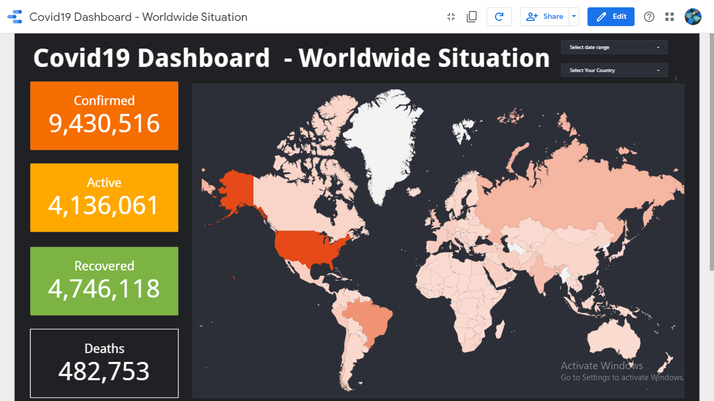

# covid19dashbaord-GoogleDataStudio

• I create this dashboard using Google Data Studio. Google Data Studio is a popular Buisness Intelligance tool which is create report and report through can be do analysis.

# Demo

• Demo Link : https://datastudio.google.com/reporting/4fe6a55f-bc16-4fdf-883d-264ed54fc482
• Website Link : https://datastudio.google.com/

# Resource 

• I create a covid 19 dashboard which is simple and easy to understandable, for this, I used data from Johns Hopkins University (JHU) data, which is store in github.
• Github link : https://github.com/CSSEGISandData/COVID-19/tree/master/csse_covid_19_data/csse_covid_19_daily_reports

